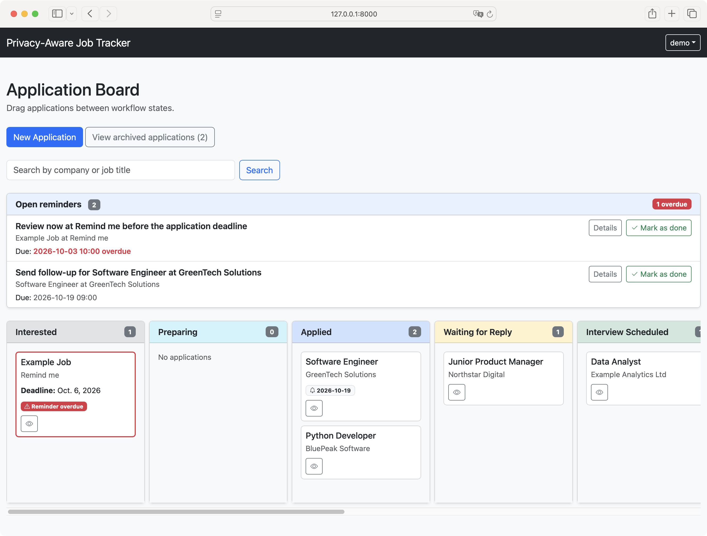
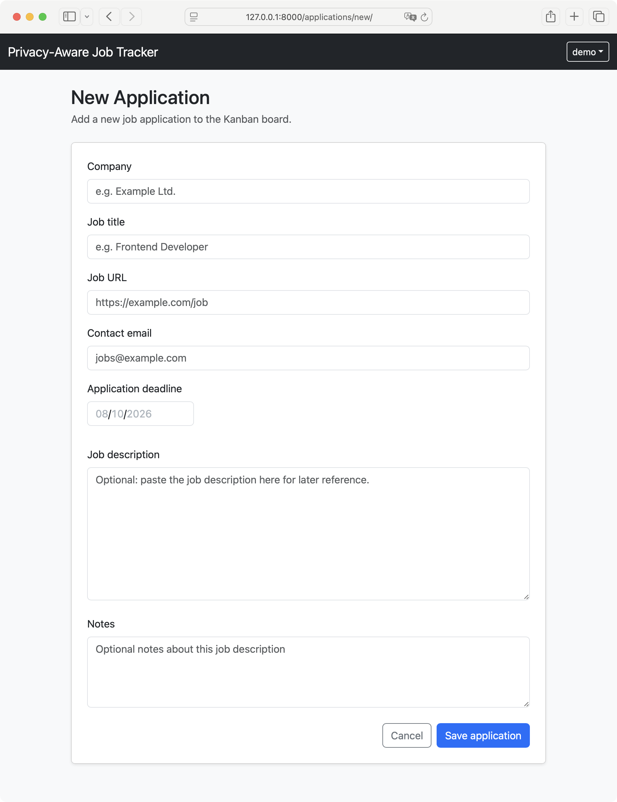
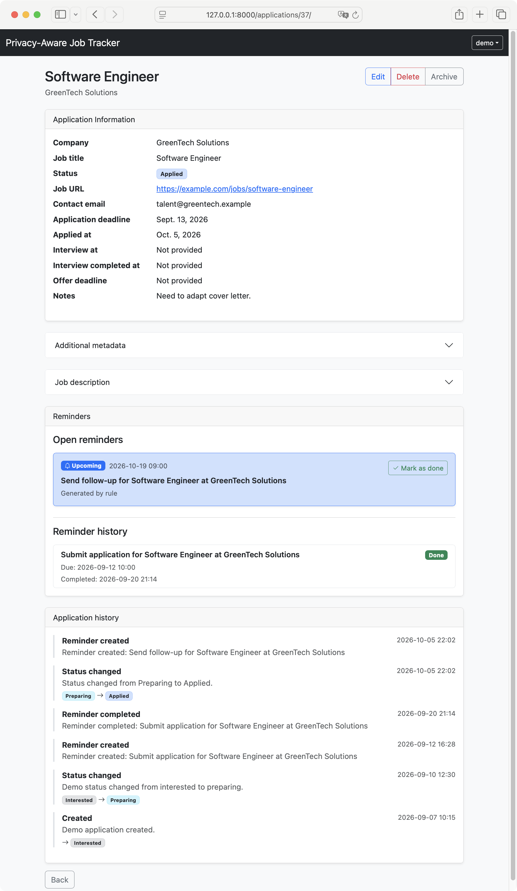
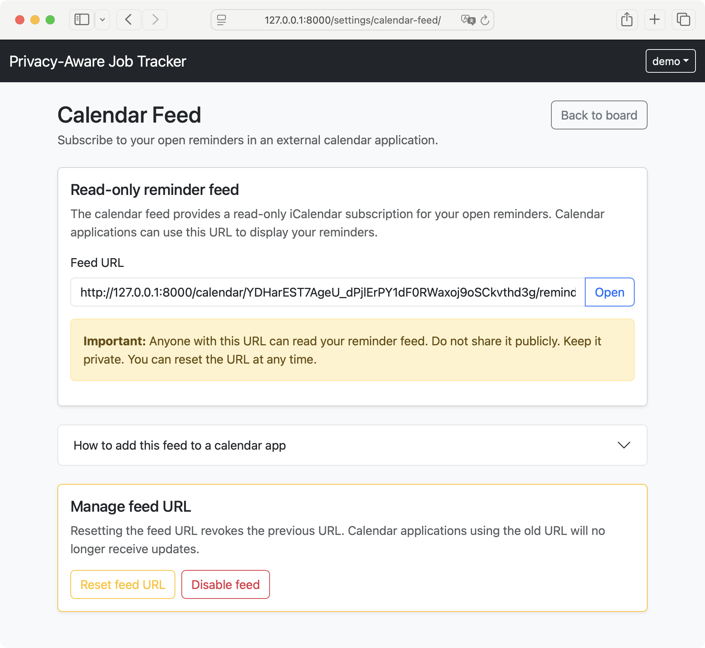

# A Privacy-Aware State-Based Workflow System for Job Application Management with Rule-Based Reminders

A research prototype for privacy-aware job application tracking using a state-based workflow model, a Kanban board, event history, rule-based reminders, and a read-only iCalendar feed.

This project was developed as an academic thesis prototype. It focuses on transparent workflow automation and reminder generation without relying on external AI services, email scanning, or job portal scraping.

The application is implemented with Django and uses a server-rendered UI with Bootstrap and SortableJS for lightweight drag-and-drop interaction.

## Features

- User registration, login and logout
- User-scoped job applications
- Kanban board for application workflow states
- Drag-and-drop state transitions
- Transition-specific date input for reminder-relevant states
- Event history for application lifecycle changes
- Rule-based reminder generation
- Open reminder list on the board
- Reminder completion and reminder history
- Archived applications view
- Search on the Kanban board
- Optional read-only iCalendar feed for open reminders

## Screenshots

### Kanban board

[](docs/screenshots/kanban-board.png)

### Create new application

[](docs/screenshots/new-application.png)

### Application detail with reminders

[](docs/screenshots/application-detail.png)

### Calendar feed settings

[](docs/screenshots/calendar-feed.png)

## Requirements

- Python 3.12+ 
- pip
- SQLite, included with Python
- A modern web browser

## Method 1: Setup with Python venv

This will setup a Python virtual environment. The project also provides a Docker setup. If you are interested refer to "Method 2: Setup with Docker".

### 1. Clone or open the project directory

```bash
cd path/to/project
```

### 2. Create a virtual environment

#### macOS / Linux

```bash
python3 -m venv env
source env/bin/activate
```

#### Windows PowerShell

```bash
python -m venv env
env\Scripts\Activate.ps1
```

### 3. Install dependencies

```bash
pip install -r requirements.txt
```

### 4. Initialise the SQLite database

```bash
python manage.py migrate
```

### 5. Start the development server

```bash
python manage.py runserver
```

## Method 2: Setup with Docker

A simple Docker Compose setup is provided for development and demonstration. Navigate with the terminal to the root 
of this application where the `Dockerfile` and `docker-compoise.yaml` resides (e.g. `cd $HOME/git/csm500-job-application-workflow`)

Start the application:

```bash
docker compose up --build
```

The Docker setup runs database migrations automatically and starts the Django development server.
For later runs, if the image does not need to be rebuilt, use:

```bash
docker compose up
```

The server runs inside the container on `0.0.0.0:8000`, but the application should be opened from the host machine at:

http://127.0.0.1:8000/

If the terminal displays `http://0.0.0.0:8000/`, do not use that URL directly in the browser.

## Access application

Open the application in your browser:

[http://127.0.0.1:8000/](http://127.0.0.1:8000/)

As a first step, register a user account through the web interface.

## Seeding Demo Data

A synthetic demo dataset is provided for screenshots, screencasts, and manual testing.
You must create a user account before running the demo data command.

**For the Python venv setup:**

`python manage.py seed_demo_data`

**For the Docker setup:**

`docker compose exec web python manage.py seed_demo_data`

The command lists available users, asks which user should receive the demo data, and asks whether existing demo data should be cleared.

## Running Tests

Run the automated test suite with:

**Python venv**

`python manage.py test`

**Docker**

`docker compose exec web python manage.py test`

The tests cover core functionality such as:

* user-scoped access
* Kanban board rendering
* workflow state transitions
* event history creation
* rule-based reminder generation
* reminder completion
* archived application handling
* iCalendar feed access and token behaviour

## Basic Usage

### 1. Register or log in

Create a user account or log in with an existing account.

### 2. Create a job application

Use the **New Application** button on the board.

Typical fields include:
* company name
* job title
* job advert URL
* contact email
* application deadline
* job description
* notes

### 3. Use the Kanban board

Applications are shown as cards grouped by workflow state.

Example states include:
* Interested
* Preparing
* Applied
* Waiting for Reply
* Interview Scheduled
* Interview Completed
* Waiting for Decision
* Offer Received
* Rejected
* Withdrawn

Cards can be moved between states using drag and drop.

Some transitions require additional date information, for example:
* moving to Applied asks for the application date
* moving to Interview Scheduled asks for the interview date and time
* moving to Interview Completed asks for the completion date
* moving to Offer Received asks for the offer deadline

These dates are used as anchors for reminder generation.

### 4. Work with reminders

Open reminders are displayed above the Kanban board.
Reminders are generated from predefined rules when applications enter certain workflow states. Cards with due or overdue reminders are visually highlighted.
A reminder can be marked as done from the board or the application detail page.

### 5. Archive applications

Archived applications are removed from the active Kanban board and shown on a separate archived applications page.

### 6. Calendar feed

The application can provide a read-only iCalendar feed for open reminders. The feed can be managed through:

```
User menu -> Calendar feed
```

The feed URL can be reset or disabled. The feed is read-only and does not provide two-way calendar synchronisation.

## Notes on Privacy

The prototype is designed to avoid unnecessary external processing:

* no external AI services
* no CV analysis
* no third-party calendar account access
* no email account integration
* reminder feed is read-only
* calendar feed access is protected by a random token
* the feed token can be reset or disabled

## Limitations

This is an academic research prototype, not a production-ready platform.
It does not include:

* email or job portal integration
* browser extension support
* external AI/NLP extraction
* secure file uploads
* password reset or email verification
* OAuth login or two-factor authentication
* two-way calendar synchronisation
* per-user timezone settings

The focus is on state-based workflow tracking, event history, rule-based reminders, and privacy-aware calendar interoperability.

## Development Notes

The core workflow is based on the following pipeline:

Kanban state change
* server-side state update
* ApplicationEvent recorded
* old rule-based reminders cancelled
* ReminderRules evaluated
* new Reminders generated
* board reloaded

The main technical focus is the state-based workflow and rule-based reminder system. The frontend uses lightweight JavaScript only for targeted interactions such as drag-and-drop transitions and quick-view modals.

## Time Zone Configuration

The application uses Django's timezone-aware datetime handling:

```python
USE_TZ = True
TIME_ZONE = "Europe/London"
```

Datetime values are stored timezone-aware by Django and displayed using the configured application timezone. The prototype currently uses a single application-wide timezone rather than per-user timezone preferences.
The iCalendar feed exports reminder events in UTC, as expected by calendar clients. Calendar applications such as Apple Calendar, Google Calendar or Outlook will normally convert these UTC timestamps to the user's local calendar timezone automatically.
For deployments in a different region, update `TIME_ZONE` in `settings.py`, for example:

```python
TIME_ZONE = "Europe/Berlin"
```

A future production version could allow users to configure their own timezone individually, but this is not implemented in this prototype.

## Useful Commands

*Note*: If you run the Docker, add `docker compose exec web` in front of the following commands, for example `docker compose exec web python manage.py makemigrations`.

**Run development server:**

```bash
python manage.py runserver
```

**Run migrations:**

```bash
python manage.py migrate
```

**Create migrations:**

```bash
python manage.py makemigrations
```

**Create superuser:**

```bash
python manage.py createsuperuser
```

**Create or update default reminder rules:**

```bash
python manage.py create_default_reminder_rules
```

Default reminder rules are created automatically during database migration. 
This command is mainly useful during development if the rules in `applications/default_reminder_rules.py` are changed, 
or if the default rules were deleted manually and should be recreated. The command is idempotent and can be run multiple times.

**Seed demo data:**

```bash
python manage.py seed_demo_data
```

**Run tests:**

```bash
python manage.py test
```

**List all registered usernames**

```bash
python manage.py shell -c "from django.contrib.auth import get_user_model; print(list(get_user_model().objects.values_list('username', flat=True)))"
```

**Change password of a registered user**

```bash
python manage.py changepassword <username>
```

## License

This project is licensed under the Apache License 2.0. See the [LICENSE](LICENSE) file for details.